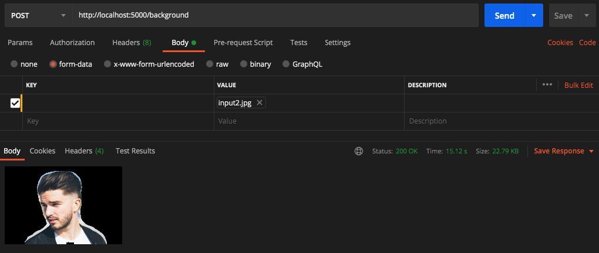

# web-service-for-semantic-segmentation

	Este código tem como objetivo criar um serviço web utilizando Flask com uma rota principal que receba uma imagem, faça um processamento e retorne o resultado.

#### Instruções para execução

1. Crie a imagem utilizando o seguinte comando: ``docker build --tag cv-challenge:0.1 .``
2. Cheque se as imagens foram criadas corretamente: ``docker images``
3. Crie e execute o container utilizando a imagem criada no passo 1: ``docker run --name cv-challenge -p 5000:5000 cv-challenge:0.1``
4. Utilize a URL ``http://localhost:5000/background`` para fazer upload de imagem utilizando o requisito ``POST``

#### Alguns Pontos Sobre o Código
 
 O algoritmo de Web Service utiliza Flask para criar o serviço e foi organizado em pequenos módulos utilizando Blueprints. Ao receber uma imagem ele utiliza Segmentação Semântica após classificar a imagem através de uma ``FCN-ResNet101`` para gerar uma máscara focando na pessoa inserida na imagem e retirar o background.

 O algoritmo demora um pouco para rodar da primeira vez pois ele faz um download do dataset COCO pré-treinado caso você não o possua no cache do Pytorch, uma vez baixado ele sempre irá acessar o dataset sem precisar fazer outro download.

#### Saída

 Resultado do processamento:
 
 